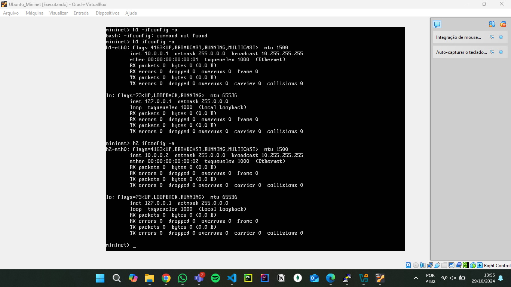

# C115-mininet-learning

## Overview

This repository is dedicated to documenting the initial learning stages of Mininet for the course *Connected Devices - C115* at *Instituto Nacional de Telecomunicações* (INATEL). Here, a proposal is presented for developing and learning in Mininet.

## Index

- [Proposal](#proposal)

- [Execution Steps](#execution-steps)
    - [1. Creating topology](#1-creating-topology)
    - [2. Checking informations of topology](#2-checking-informations-of-topology)
        - [Hosts configurantions](#hosts-configurantions)
        - [Dump of topology](#dump-of-topology)
        - [Net of topology](#net-of-topology)
        - [Nodes of topology](#nodes-of-topology)
    - [3. Pings among different nodes](#3-pings-among-different-nodes)
    - [4. Specifying host 1 as server and host 2 as client](#4-specifying-host-1-as-server-and-host-2-as-client)
        - [Configuration of putty](#configuration-of-putty)
        - [Login in mininet using puTTy](#login-in-mininet-using-putty)
        - [Using Xterm to make h1 as a server and h2 as a client](#using-xterm-to-make-h1-as-a-server-and-h2-as-a-client)

- [Author](#author)

## Proposal

The proposal for this project is as follows:

```text
Consider a tree topology with depth=4 and fanout=2.
    - Using the standard Mininet command line, create the topology with standardized MAC addresses, a bandwidth (bw) of 25 Mbps, and the default Mininet controller (no need to specify);
    - Inspect interface information, MAC addresses, IP addresses, and ports using command-line inspection;
    - Run ping tests between different nodes;
    - Specify that host 1 on port 5555 will be a TCP server and host 2 will be a client, then execute iperf tests, reporting every second for a 10-second test. Conduct the tests with a bandwidth (bw) of 25 Mbps.
```

## Execution Steps

### 1. Creating topology


---

### 2. Checking informations of topology

#### Hosts configurantions




---

#### Dump of topology


---

#### Net of topology


---

#### Nodes of topology


---

### 3. Pings among different nodes


---

### 4. Specifying host 1 as server and host 2 as client


#### Configuration of putty


---

#### Login in mininet using puTTy


---

#### Using Xterm to make h1 as a server and h2 as a client


## Author

### [Matheus Fonseca](https://github.com/matheusAFONSECA)

Undergraduate student in the eighth (8th) semester of Computer Engineering at the National Institute of Telecommunications (Inatel). I participated in a Scientific Initiation at the Cybersecurity and Internet of Things Laboratory (CS&ILAB), where, in the Park Here project, I developed skills in computer vision applied to parking systems, focusing on license plate recognition and vehicle identification. Additionally, I served as a teaching assistant for Physics 1, 2, and 3, helping with practical classes, report writing, and answering theoretical questions. Currently, I am an intern at the Inatel Competence Center (ICC) in the PDI SW department.